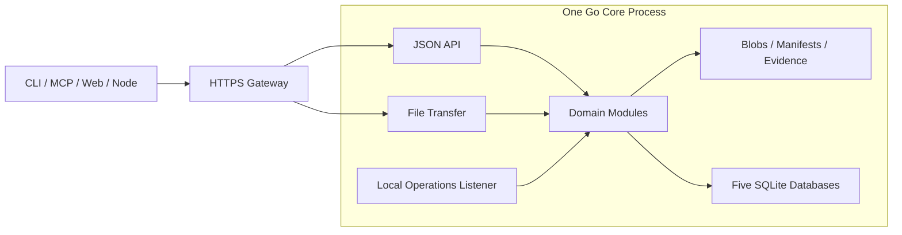

# Lantai · 兰台

**An asset archive and collaboration workspace for agents.**

[简体中文](README.md) · English

Lantai manages images, video, audio, configuration, documents, and 3D models, motion, characters, and scenes. Agents work within project permissions to ingest, describe, produce, validate, and hand off assets. Humans make review decisions. Each delivery retains explicit versions, provenance, checks, and operation records so the next participant can identify and reproduce its inputs.

The name comes from Lantai, an imperial archive in the Han dynasty. Agents act as archive clerks; humans remain accountable for review decisions.

## Project status

The project is in **early development**. The Go project and the shared contracts are in place: identifiers, digests and canonicalization, request idempotency and receipts, the error model, the event envelope, operation stages, cross-module interfaces with stubs, and the shared execution and extension-host rules. The M1 instance foundation and identity module are implemented as well: a single-writer data-root lock, per-database migrations with a compatibility matrix, the maintenance barrier and readiness gate, one-time local initialization (password, TOTP, and recovery codes), sessions and delegation, live authorization with a defined revocation order, action-bound human authorization for credential and policy management, and restricted factor recovery. The M1 part of resources and storage (T02) is implemented too: cross-platform path rules, manifest normalization and freezing, path aliases with generations and reference resolution, conditional description revisions, a content-addressed blob store, multipart uploads with resume, operation-bound content reuse grants, read grants bound to the holder's own session and re-checked on every GET/Range request, idempotent version installs with quarantine, append-only evidence records, and interactive/batch transfer admission. The M1 ledger and provenance modules (T03) now provide durable namespace claims, version reservations and commits, effective metadata revisions, authoritative reads and recovery reconciliation, immutable source chains, and current use restrictions. M1 events and query (T04) provide multi-source outbox collection, transactional consumers and pending commands, audit export with watermark-constrained retention, rebuildable directory/text/relation projections, and internal resynchronization. These modules are tested together with real instance, identity, file, and SQLite implementations; the overall M1 acceptance gate remains separate.

The M1 deliverables for T05/T06 are task, flow, and execution contracts, state rules, static interface stubs, and positive/negative examples; the M2 T05 task and flow services are now implemented internally (see below). T07 provides real REST and thin CLI workflows: session authentication, project/type discovery, resumable upload and idempotent commit, exact-version retrieval and download, conditional metadata updates, search, and operation status. `lantai serve` statically assembles the real modules with separate internal API/transfer listeners, a merged development mode, and local-only operations endpoints; JSON and file traffic use separate connection pools.

T08 now provides common-point backup and empty-directory restoration: four authoritative databases and mutable files (including retained trash versions and evidence) are captured under one maintenance barrier, persistent backup pins protect blob copying, and interrupted work can resume. Restoration advances the recovery epoch, revokes old credentials, rotates the master key, and keeps service closed until a new administrator setup, index rebuild, and local reconciliation finish. Local commands now include `backup`, `backup-verify`, `restore`, `restore-complete`, `fsck`, `recover`, and `reindex`, alongside `init`, `migrate`, `doctor`, `recover-admin`, and `serve`; new upgrades require a complete backup. Generic single-HTTPS-gateway, container, and systemd templates, local health/readiness/metrics, and redacted access logs are available. T09 implements the unified manifest and official built-in static registry with verifiable package and core-release provenance.

The M2 T01/T02 domain adapters now provide action-bound human authorization batches for resources and extensions, conditional project milestone/owner metadata, trash/restore/purge file operations and GC retention checks, and versioned project context/decision reads. Review, task queries, extension enablement and GC scheduling are now wired by T03/T05/T09/T08. T07 wires remote task, human-review and lifecycle endpoints, plus REST milestone configuration and authorized progress queries; due purge and GC scheduling are off by default and need an explicit deployment setting. See the [M2 collaboration adapter contract](docs/contracts/collaboration-foundation.md).

T03/T04 now expose internal domain interfaces for immutable discussions, locks and human control commands, fixed acceptance targets and accepted evidence, human reviews, publication receipts with atomic revocation, permission-filtered events, resynchronization and identity inboxes. Trash, restoration, hold and purge now use durable intents, real file recovery, alias generations, invalidation of old read grants, due reminders and tombstone inventories. Rights assertions support appended restrictions, human-authorized corrections and releases, new-evidence checks and current relation verification. Accepted review and rights evidence is included in recovery inventories. Initial profiles require explicit owner submission and human approval; reviews and scoped waivers have shared contracts and stable identifiers. Reviews, discussions and trash items now feed inboxes through real ledger records and current membership roles. Failed rebuild transactions preserve the prior projection and read positions; tombstones omit old paths and reasons when content access cannot be rechecked. Directory and batch trash use fixed authorization sets with per-item results. Ordinary deletion retains name claims until a separate admin approval releases them. Unfinished deletions keep their quota reservations; successful completion sets the rolling count time. A current owner may cancel an unmoved failed deletion after reconciliation, atomically releasing quota and preventing the old operation from running again. Whole-asset trash preserves earlier trashed or purged history. Restoration keeps those entries’ independent retention and holds; empty containers perform no file operations. Evidence inventories include orphaned trash records, verify current locations and preserve anomalous files for reconciliation. Directory archival commits a fixed set per item; project archival verifies the complete target set and project-wide idle state while preserving historical reads. Failed inbox deliveries can be inspected in pages and retried under maintenance. Real identity and file tests cover selected acceptance boundaries. Task ports are now served by the real T05 modules; T06 now wires real checks and T07 provides remote collaboration endpoints. See [review and collaboration interfaces](docs/contracts/review-collaboration.md).

M2 T05 adds internal task and flow services: single-seat task creation, assignment, atomic claims, heartbeats, release, expiry revocation, cancellation, delivery, completion, and rework. Stale attempts, fences, and recovery epochs are rejected at every final acceptance point, including claims, delivery, evidence, and ledger version commits; revoked execution reopens only after stop and side effects are reconciled. Exclusive and advisory checkouts are rechecked by a ledger commit guard. Blocking and handoff reference immutable discussion messages, and answers only lift the wait. The fixed sequential flow (produce → (check) → (QA) → review → publish) runs a definition pinned to an exact config version, advances on domain events, dispatches persisted commands idempotently, opens new rework rounds while preserving history, and completes the production task, releases downstream task dependencies, and finishes the flow only after the ledger reports publication; pausing stops dispatch and review, and cancellation propagates to tasks. The T03 review execution bridge, archival idleness checks, task discussions, T04 inboxes, and milestone progress now use the real task ports. T06 now implements the real Job ports; T07 supplies remote endpoints and explicit Flow dispatch. Business triggers and scheduled sweeps remain disabled. See the [task and business flow contract](docs/contracts/tasks.md).

T06/T07 now provide manual session execution, durable checkpoints and cumulative budgets, human input, cancellation/reconciliation, independent Job leases, and an official corecheck one-shot subprocess. REST/CLI cover tasks, flows, execution, reviews, lifecycle, context and collaboration reads. An official Go SDK stdio MCP adapter and a minimal Python client use the same API. MCP local uploads validate JSON objects against the public commit contract, with regression coverage for four-client uploads, idempotent replay, and backup/restore consistency. The core rechecks candidates and check results; execution success does not grant human approval. One-shot validators can return a named business check bound to the actual configuration while retaining four independent core checks. Final human review rechecks current enablement, package approval and project allowlists; historical evidence remains readable. See [manual execution and remote collaboration](docs/contracts/manual-execution.md).

On Windows, atomic replacement of audit manifests and similar files retries file-occupation errors within a bounded window; persistent failure retains the prior file and audit watermark and returns an error.

M2 T09 implements the one-shot file-protocol host (private run directory, environment allowlist, verified entry copy, deadlines and output limits, process-group/job-object reclaim, result rejection when private-directory cleanup fails, and an honest report of isolation it cannot enforce), static import of external packages referencing ledger reviews, HumanGrant-bound enable/disable with config revisions, restricted pre-enable probes, per-project allowlists, drain/revoke, and the §11.2 circuit breaker; an external checker can produce evidence inside a fixed Flow. `lantai plugin`/`lantai ext` and an MCP projection provide explicit local commands, and [`sdk/go/extension`](sdk/go/extension/) is the minimal plugin SDK. T08 adds a due-reminder/purge and recoverable GC scheduler with registered jobs and resumable work, off by default. See [extension governance](docs/contracts/extension-governance.md) and [lifecycle scheduling](docs/contracts/lifecycle-scheduler.md) (Chinese).

The web app, resident extension instances, third-party web plugins, and automatic runners are not enabled; the one-shot host is not a security sandbox. Production deployment, target NAS traffic, platform failures, and full restoration still require separate acceptance in the actual environment; development tests do not establish the overall M1 gate.

- [Architecture and top-level layout](docs/architecture.md) — Chinese
- [Shared contracts](docs/contracts/README.md) — Chinese
- [Common-point backup and restoration](docs/contracts/backup-restore.md) / [Gateway deployment templates](docs/deployment.md) — Chinese
- [Release artifacts](docs/release-artifacts.md) — Chinese: maintainers manually build images, six-platform binaries and checksums from an exact commit with successful main CI; CLI/MCP accept a client-scoped private CA through `--ca-file`.
- [Development and verification commands](docs/development.md) — Chinese
- [Commit process-kill, recovery and native file-fault drivers](docs/testing/commit-fault-matrix.md)
- [Module tasks and implementation order](docs/tasks/README.md) — Chinese
- [Server, client, and web extension design](docs/extensions.md) — Chinese
- [Documentation index](docs/README.md)


Check results are validated against the complete wire contract before decoding, and public evidence wrappers retain the exact execution source. Normal draining lets admitted calls finish; completed checks used for a new review or publication still require current enablement and probe qualification. Historical evidence remains readable.

## What Lantai is for

- **Traceable assets**: stable asset IDs, immutable versions, manifests, provenance, and license evidence.
- **Explicit handoffs**: tasks, execution attempts, leases, and acceptance evidence; stale results cannot overwrite current work.
- **Auditable review and publication**: QA suggestions, human decisions, and the current published version are separate records, with rework and publication rollback.
- **Recoverable failures**: defined protocols for file commits, operation receipts, event replay, trash, and backup restoration.
- **Room for automation**: execution adapters, checkpoints, budgets, human input, and triggers for task-based agent workflows.

Implementation priority: **data correctness → agent usability → reliable collaboration → human access → presentation quality**.

## Architecture direction

The baseline is a **modular Go monolith, file storage, and five SQLite databases**. CLI, MCP, and the independently deployed web app access the core through public interfaces. Nodes process assets or host agents using sessions issued by the server.



A single gateway port is exposed externally. The core uses separate listeners for API requests, file transfer, and local operations; a future push layer adds a streaming listener. These listeners remain part of one core process. Interactive and bulk transfers use separate resource quotas, and clients use transfer addresses returned by the server.

| Storage | Responsibility |
|---|---|
| Files | Original bytes, immutable manifests, revisioned metadata, and append-only evidence |
| `main.db` | Identities, permissions, policies, sensitive-action grants, and extension registration/enablement configuration |
| `ledger.db` | Version registration, reviews, publication, locks, and lifecycle |
| `runtime.db` | Sessions, tasks, leases, flows, jobs, and extension instances |
| `events.db` | Event delivery records and audit watermarks |
| `index.db` | Rebuildable catalog and search projections |

Each table has one owning module. Modules do not share transactions or join across module or database boundaries. Business results, operation receipts, and outbox entries commit together in their owning database; replayable events drive subsequent work.

## Task-based workflows

Orchestration has two layers:

- **Business Flow** deterministically advances production, checks, QA, human review, and publication.
- **Agent execution** plans steps, calls tools, delegates to subagents, and delivers candidates within one Task's authorization scope.

The execution layer reserves a common start, status, resume, cancel, and result protocol. DeerFlow or another agent runtime can become an optional adapter backend. Execution success still requires Lantai's acceptance and publication rules; backends cannot write review records directly.

M1 reserves the protocol, M2 connects manually started agent sessions, and M3 adds automatic runners and event or scheduled triggers. See [tasks and flows](docs/tasks/T05-tasks-workflow.md) and [agent execution and nodes](docs/tasks/T06-execution-nodes.md).

## Plugin extensions

Plugin packages use one `extension.yaml` manifest with schema `lantai.extension/v1`, including processor fields. M1 only implements the shared manifest, extension-point IDs, a built-in static registry, and plugin IDs, versions, and package digests in artifacts and evidence. Only server/node processor and validator extension points are enabled; CLI/Web fields are reserved. Generic dependency injection, cross-plugin dependency graphs, and service containers are deferred until a concrete need arises.

M2 runs one-shot processors through a file protocol (spawn/run/exit), adding package governance, revocation, draining, circuit breaking, and explicit CLI extensions without requiring a persistent control protocol. M3 provides official components and declarative web slots; third-party web isolation is separate work driven by demand, not an M3 commitment. The core retains final authority over authorization, commits, reviews, publication, and task leases; a subprocess is not a security sandbox. The [extension design](docs/extensions.md) is the sole authoritative plugin implementation specification, the [reference assessment](docs/references/plugin-systems.md) provides its rationale, and the [T09 task](docs/tasks/T09-extension-platform.md) defines implementation scope. The M1 manifest and official built-in `corecheck` static component, and the M2 one-shot host, package governance, circuit breaker, and explicit CLI are implemented; resident control protocols, cross-plugin dependencies, and web hosts are not enabled.

## Top-level layout

```text
lantai/
├── api/        # HTTP contracts and generation rules
├── cmd/        # Go executable entry points
├── deploy/     # Generic deployment and service-management templates
├── docs/       # Public architecture, decisions, and development tasks
├── internal/   # Go core, domain modules, and internal adapters
├── plugins/    # Official extension packages, host contributions, and examples
├── schemas/    # Data, event, plugin, and execution protocol schemas
├── scripts/    # Build, generation, checks, and development helpers
├── sdk/        # External client and plugin SDKs
├── tests/      # Cross-module contract, fault, integration, and end-to-end tests
└── web/        # Independently built and deployed web application
```

Source code is added with the corresponding tasks. So far this includes the `cmd/lantai` entry point (with local instance commands, service startup, and remote CLI), the shared contracts, command components, instance lifecycle (`operations`), identity module (`identity`), resource and storage modules (`catalog`, `storage`), ledger and provenance (`ledger`, `provenance`), and events and query (`events`, `query`) in `internal/`, the built-in registry in `extensions`, common-point backup/restoration in `operations`, real module assembly in `internal/application`, HTTP transport in `transport/httpapi`, `client`/`cli`, the cross-module integration tests in `tests/integration`, the shared schemas and examples in `schemas/`, the shared HTTP contract in `api/`, and the generation and check scripts in `scripts/`; `deploy/` contains generic deployment templates and `plugins/corecheck` contains the official static component; web and SDK implementations follow their respective stages. Production data, databases, backups, and local configuration belong outside the repository. See the [layout boundaries](docs/architecture.md#top-level-layout).

## Roadmap

| Stage | Focus |
|---|---|
| M1 Data foundation | Identity and authorization, reliable ingest, exact-version retrieval, events, index rebuilding, backup restoration, and platform validation |
| M2 Collaboration | Tasks and leases, fixed flows, manual agent execution, checks and QA, human review through CLI, publication, trash, and MCP |
| M3 Processing and automation | More processors, automatic runners, task-local subagents, triggers, and a minimal web app |
| M4 Migration | Validate and import under a separate migration plan after the M2 gate; may run alongside M3 |
| M5–M8 Extensions | Rich previews, semantic search and DCC integration, push and IM, storage expansion, and inter-instance collaboration |

Development starts with **T00 Engineering and contracts**, followed by the M1 [task dependencies](docs/tasks/README.md); the instance foundation (T08.1), identity and security (T01), resources and storage (T02), ledger/provenance (T03), and events/query (T04) implement their respective M1 scopes, alongside the M1 T05/T06 contracts, T07 REST/CLI storage workflow, T08 backup/restoration and operations templates, and T09 built-in extension registration. Feature, performance, and recovery claims require recorded acceptance results.

## Contributing

The core and CLI use Go (the toolchain is pinned in `go.mod`); TypeScript/React is planned for the web app, and suitable languages for individual processors. Run `scripts/check.sh` before submitting changes and `scripts/generate.sh` after changing contracts. Commands, dependencies, and platform verification status are listed in [Development and verification](docs/development.md) and [Dependencies and licenses](docs/dependencies.md) (Chinese).

The public repository accepts general-purpose code, documentation, configuration templates, and synthetic fixtures. Real assets, credentials, host addresses, private paths, production configuration, and internal notes remain private. Preserve licenses and attribution when adding third-party code.

## License

Lantai is licensed under the [GNU GPL v3](LICENSE).
