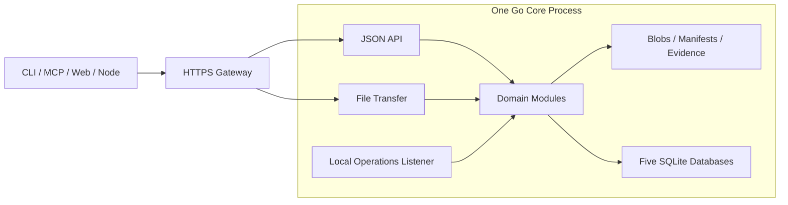

# Lantai · 兰台

**An asset archive and collaboration workspace for agents.**

[简体中文](README.md) · English

Lantai manages images, video, audio, configuration, documents, and 3D models, motion, characters, and scenes. Agents work within project permissions to ingest, describe, produce, validate, and hand off assets. Humans make review decisions. Each delivery retains explicit versions, provenance, checks, and operation records so the next participant can identify and reproduce its inputs.

The name comes from Lantai, an imperial archive in the Han dynasty. Agents act as archive clerks; humans remain accountable for review decisions.

## Project status

The project is in **pre-development preparation**. This repository contains the first directory plan, architecture outline, and module backlog, awaiting maintainer confirmation before implementation starts.

There is no runnable service, installation package, or verified deployment command yet. The capabilities below are design targets; directory notes do not indicate implemented features. Dependency versions, platform behavior, and performance will be established during the first validation work.

- [Architecture and top-level layout](docs/architecture.md) — Chinese
- [Module tasks and implementation order](docs/tasks/README.md) — Chinese
- [Server, client, and web extension design](docs/extensions.md) — Chinese
- [Documentation index](docs/README.md)

## What Lantai is for

- **Traceable assets**: stable asset IDs, immutable versions, manifests, provenance, and license evidence.
- **Explicit handoffs**: tasks, execution attempts, leases, and acceptance evidence; stale results cannot overwrite current work.
- **Auditable review and publication**: QA suggestions, human decisions, and the current published version are separate records, with rework and publication rollback.
- **Recoverable failures**: defined protocols for file commits, operation receipts, event replay, trash, and backup restoration.
- **Room for automation**: execution adapters, checkpoints, budgets, human input, and triggers for task-based agent workflows.

Implementation priority: **data correctness → agent usability → reliable collaboration → human access → presentation quality**.

## Architecture direction

The baseline is a **modular Go monolith, file storage, and five SQLite databases**. CLI, MCP, and the independently deployed web app access the core through public interfaces. Nodes process assets or host agents using sessions issued by the server.



A single gateway port is exposed externally. The core uses separate listeners for API requests, file transfer, and local operations; a future push layer adds a streaming listener. These listeners remain part of one core process. Interactive and bulk transfers use separate resource quotas, and clients use transfer addresses returned by the server.

| Storage | Responsibility |
|---|---|
| Files | Original bytes, immutable manifests, revisioned metadata, and append-only evidence |
| `main.db` | Identities, permissions, policies, sensitive-action grants, and extension registration/enablement configuration |
| `ledger.db` | Version registration, reviews, publication, locks, and lifecycle |
| `runtime.db` | Sessions, tasks, leases, flows, jobs, and extension instances |
| `events.db` | Event delivery records and audit watermarks |
| `index.db` | Rebuildable catalog and search projections |

Each table has one owning module. Modules do not share transactions or join across module or database boundaries. Business results, operation receipts, and outbox entries commit together in their owning database; replayable events drive subsequent work.

## Task-based workflows

Orchestration has two layers:

- **Business Flow** deterministically advances production, checks, QA, human review, and publication.
- **Agent execution** plans steps, calls tools, delegates to subagents, and delivers candidates within one Task's authorization scope.

The execution layer reserves a common start, status, resume, cancel, and result protocol. DeerFlow or another agent runtime can become an optional adapter backend. Execution success still requires Lantai's acceptance and publication rules; backends cannot write review records directly.

M1 reserves the protocol, M2 connects manually started agent sessions, and M3 adds automatic runners and event or scheduled triggers. See [tasks and flows](docs/tasks/T05-tasks-workflow.md) and [agent execution and nodes](docs/tasks/T06-execution-nodes.md).

## Plugin extensions

Plugin packages use one `extension.yaml` manifest with schema `lantai.extension/v1`, including processor fields. M1 only implements the shared manifest, extension-point IDs, a built-in static registry, and plugin IDs, versions, and package digests in artifacts and evidence. Only server/node processor and validator extension points are enabled; CLI/Web fields are reserved. Generic dependency injection, cross-plugin dependency graphs, and service containers are deferred until a concrete need arises.

M2 runs one-shot processors through a file protocol (spawn/run/exit), adding package governance, revocation, draining, circuit breaking, and explicit CLI extensions without requiring a persistent control protocol. M3 provides official components and declarative web slots; third-party web isolation is separate work driven by demand, not an M3 commitment. The core retains final authority over authorization, commits, reviews, publication, and task leases; a subprocess is not a security sandbox. The [extension design](docs/extensions.md) is the sole authoritative plugin implementation specification, the [reference assessment](docs/references/plugin-systems.md) provides its rationale, and the [T09 task](docs/tasks/T09-extension-platform.md) defines implementation scope. None of these capabilities is implemented yet.

## Top-level layout

```text
lantai/
├── api/        # HTTP contracts and generation rules
├── cmd/        # Go executable entry points
├── deploy/     # Generic deployment and service-management templates
├── docs/       # Public architecture, decisions, and development tasks
├── internal/   # Go core, domain modules, and internal adapters
├── plugins/    # Official extension packages, host contributions, and examples
├── schemas/    # Data, event, plugin, and execution protocol schemas
├── scripts/    # Build, generation, checks, and development helpers
├── sdk/        # External client and plugin SDKs
├── tests/      # Cross-module contract, fault, integration, and end-to-end tests
└── web/        # Independently built and deployed web application
```

Each directory currently contains responsibility notes only. Source packages and project configuration will be created when the corresponding task starts. Production data, databases, backups, and local configuration belong outside the repository. See the [layout boundaries](docs/architecture.md#top-level-layout).

## Roadmap

| Stage | Focus |
|---|---|
| M1 Data foundation | Identity and authorization, reliable ingest, exact-version retrieval, events, index rebuilding, backup restoration, and platform validation |
| M2 Collaboration | Tasks and leases, fixed flows, manual agent execution, checks and QA, human review through CLI, publication, trash, and MCP |
| M3 Processing and automation | More processors, automatic runners, task-local subagents, triggers, and a minimal web app |
| M4 Migration | Validate and import under a separate migration plan after the M2 gate; may run alongside M3 |
| M5–M8 Extensions | Rich previews, semantic search and DCC integration, push and IM, storage expansion, and inter-instance collaboration |

Development starts with **T00 Engineering and contracts**, followed by the M1 [task dependencies](docs/tasks/README.md). Feature, performance, and recovery claims require recorded acceptance results.

## Contributing

The current review scope is the layout and task boundaries. Once the development plan is confirmed, work begins on the project setup, dependency lock-in, and first interfaces. Go is planned for the core and CLI, TypeScript/React for the web app, and suitable languages for individual processors.

The public repository accepts general-purpose code, documentation, configuration templates, and synthetic fixtures. Real assets, credentials, host addresses, private paths, production configuration, and internal notes remain private. Preserve licenses and attribution when adding third-party code.

## License

Lantai is licensed under the [GNU GPL v3](LICENSE).
