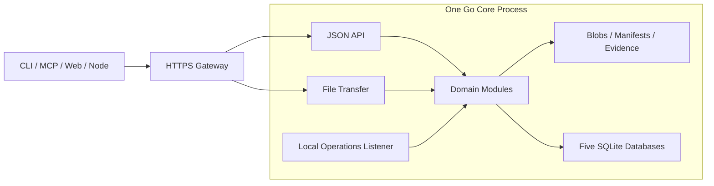

# Lantai · 兰台

**面向 Agent 的素材档案库与协作工作台。**

简体中文 · [English](README.en.md)

Lantai 管理图像、视频、音频、配置、文档，以及 3D 模型、动作、角色和场景。多个 Agent 在项目权限内完成入藏、著录、制作、校验与交接，人负责审定。每次交付保留明确的版本、来源、检查证据和操作记录，让下一位参与者能找到并复现所用素材。

“兰台”取名自汉代的图籍档案收藏机构。Agent 如令史，负责存取与整理；人对审定结论负责。

## 当前状态

项目处于**开发前准备阶段**。本仓库已整理第一版目录、架构说明与模块任务，等待维护者确认后进入开发。

目前没有可运行的服务、安装包或已验证的部署命令。下文描述的是设计目标；目录中的说明文件不代表功能已经实现。依赖版本、跨平台行为和性能由首轮技术验证确定。

- [架构与一级目录](docs/architecture.md)
- [模块任务与开发顺序](docs/tasks/README.md)
- [服务端、客户端与网页扩展设计](docs/extensions.md)
- [文档导航](docs/README.md)

## 要解决的问题

- **素材有据可查**：稳定资产 ID、不可变版本、文件清单、来源与许可记录。
- **协作有明确交接**：任务、执行轮次、租约和验收证据，迟到的执行结果不能覆盖当前工作。
- **审定和发布可追溯**：质检建议、人审结论和当前发布版本分别记录，支持退回、重新提交和发布回滚。
- **失败能够恢复**：文件提交、操作回执、事件重放、回收站与备份恢复按明确协议推进。
- **自动化有扩展位置**：为任务式 Agent workflow 预留执行适配器、检查点、预算、人工等待与触发机制。

实现优先级：**数据正确 → Agent 可用 → 协作顺畅 → 人可查看 → 展示体验**。

## 架构方向

采用 **Go 模块化单体 + 文件存储 + 五个 SQLite 库**。CLI、MCP 和独立网页通过公开接口访问核心；节点执行素材处理或托管 Agent，会话权限由服务端签发。



一个网关端口对外提供服务。核心内部将接口、文件传输和本机运维分开监听；后续推送另加长连接监听。这些监听仍属于同一核心进程。网页交互和批量传输使用不同的资源配额，客户端使用服务端返回的传输地址。

| 存储 | 职责 |
|---|---|
| 文件 | 原件、不可变清单、有修订的著录与追加证据 |
| `main.db` | 身份、权限、策略、敏感操作授权与扩展登记/启用配置 |
| `ledger.db` | 版本登记、审定、发布、锁定与生命周期 |
| `runtime.db` | 会话、任务、租约、流程、作业与扩展实例 |
| `events.db` | 事件派送记录与审计水位 |
| `index.db` | 可重建的目录与检索投影 |

每张表由一个模块负责写入；跨模块、跨库不共享事务、不联表。业务结果、操作回执和 outbox 在所属库内一起提交，后续动作通过可重放事件推进。

## 任务式 Workflow

编排分成两层：

- **业务 Flow**：确定性地推进制作、检查、质检、人审与发布。
- **Agent 执行**：在一个 Task 的授权范围内规划步骤、调用工具、委派子 Agent 并交付候选结果。

执行层预留统一的启动、查询、恢复、取消和取结果协议。DeerFlow 或其他 Agent runtime 可以成为后续适配后端。执行成功仍需经过兰台的验收与发布规则；执行后端不能直接修改审定台账。

M1 预留协议，M2 先接手动 Agent 会话，M3 再接自动运行器与事件、定时触发。详见 [任务与流程](docs/tasks/T05-tasks-workflow.md)和 [Agent 执行与节点](docs/tasks/T06-execution-nodes.md)。

## 插件扩展

三端共用插件身份、包摘要、版本、权限与依赖声明，各宿主独立启用。服务端预留校验器、处理器、Agent 后端、连接器与能力服务；客户端采用显式注册命令；网页采用声明式插槽、首方组件及经过隔离验证的第三方视图。

核心保留授权、提交、审定、发布与任务租约的最终判断。M1 先做契约和官方静态注册，M2 验证进程外插件与 CLI，M3 增加网页扩展。子进程不等于安全沙箱。详见[扩展设计](docs/extensions.md)、[参考评估](docs/references/plugin-systems.md)和 [T09 任务](docs/tasks/T09-extension-platform.md)；这些能力目前均未实现。

## 一级目录

```text
lantai/
├── api/        # HTTP 契约与生成规则
├── cmd/        # Go 可执行程序入口
├── deploy/     # 通用部署与服务管理模板
├── docs/       # 公开架构、决策与开发任务
├── internal/   # Go 核心、领域模块及内部适配器
├── plugins/    # 官方扩展包、各端贡献与示例
├── schemas/    # 数据、事件、插件与执行协议的 schema
├── scripts/    # 构建、生成、检查与开发辅助脚本
├── sdk/        # 外部客户端与插件 SDK
├── tests/      # 跨模块契约、故障、集成与端到端测试
└── web/        # 独立构建和部署的网页工程
```

本轮各目录只放职责说明；源码包与工程配置在对应任务启动时创建。生产数据、数据库、备份和本地配置放在仓库之外。具体边界见[目录说明](docs/architecture.md#top-level-layout)。

## 路线

| 阶段 | 交付重点 |
|---|---|
| M1 数据底座 | 身份与权限、可靠入藏、精确版本调阅、事件、检索重建、备份恢复和跨平台验证 |
| M2 协作底座 | 任务与租约、固定流程、手动 Agent 执行、检查与质检、CLI 人审、发布、回收站和 MCP |
| M3 数据处理与自动化 | 更多处理插件、自动运行器、任务内子 Agent、触发机制与最小网页 |
| M4 数据迁移 | M2 门禁通过后，按独立迁移计划验收与导入；可与 M3 并行 |
| M5–M8 扩展 | 展示增强、语义检索与 DCC 集成、推送与 IM、存储扩容与馆际协作 |

首批开发从 **T00 工程与契约** 开始，再按[任务依赖](docs/tasks/README.md)推进 M1。功能、性能和恢复能力以验收记录为准。

## 参与开发

当前可审阅目录和任务边界；确认开发计划后再建立工程、锁定依赖并实现首批接口。计划使用 Go 开发核心与 CLI，TypeScript/React 开发网页，按处理能力选择插件语言。

公开仓库只接受通用代码、文档、配置模板和合成测试数据。真实素材、凭据、主机地址、私有目录、生产配置与内部笔记原文保留在私有环境。新增第三方代码时保留其许可证与归属信息。

## 许可证

本项目使用 [GNU GPL v3](LICENSE)。
