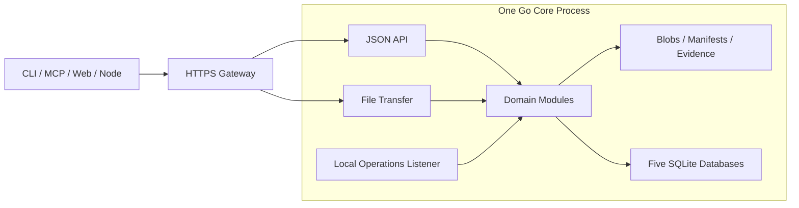

# Lantai · 兰台

**面向 Agent 的素材档案库与协作工作台。**

简体中文 · [English](README.en.md)

Lantai 管理图像、视频、音频、配置、文档，以及 3D 模型、动作、角色和场景。多个 Agent 在项目权限内完成入藏、著录、制作、校验与交接，人负责审定。每次交付保留明确的版本、来源、检查证据和操作记录，让下一位参与者能找到并复现所用素材。

“兰台”取名自汉代的图籍档案收藏机构。Agent 如令史，负责存取与整理；人对审定结论负责。

## 当前状态

项目处于**开发起步阶段**。已建立 Go 工程与公共契约：标识、摘要与规范化、请求幂等与回执、错误模型、事件信封、操作阶段、跨模块接口与桩，以及执行与扩展宿主的公共约定。M1 的实例底座与身份模块也已实现：数据根单实例锁、五库按库迁移与兼容矩阵、维护屏障与就绪门禁，本机一次性初始化（口令、TOTP、恢复码）、会话与委托、实时授权与撤权顺序、凭据与策略管理的动作绑定人类授权，以及受限的因子恢复。资源与存储的 M1 部分（T02）也已实现：跨平台路径规则、版本清单的规范化与冻结、带代次的路径别名与引用解析、说明的条件修订，内容寻址的原件库、分片上传与断点续传、绑定操作的内容复用授权、绑定本人会话并逐请求复核的读取授权与 Range 下载、幂等的版本文件安装与隔离、证据追加，以及交互/批量两档的传输准入。台账与溯源的 M1 部分（T03）已补齐持久占名、版本预留与提交、说明生效修订、权威读取与恢复核对、不可变来源链和用途限制；事件与查询的 M1 部分（T04）已实现多源 outbox 收录、事务消费与待执行命令、审计导出与水位约束裁剪、可重建目录/文本/关联投影和内部重同步模型。上述模块已使用真实实例、身份、文件与 SQLite 库联合测试；M1 整体门禁仍另行验收。

T05/T06 的 M1 交付为任务、流程与执行协议、状态判定、静态接口桩和正反例；T05 的 M2 任务与流程已作为内部服务实现（见下文）。T07 提供真实 REST 与薄 CLI：经会话完成项目/类型查询、可恢复上传与幂等提交、精确版本调阅/下载、条件著录更新、查询和 operation 状态。`lantai serve` 静态组装真实模块，提供分开的 API/传输内部监听、开发 merged 模式及仅本机运维端点；JSON 与文件传输采用独立连接池。

T08 已提供共同备份与空目录恢复：四个权威库和可变文件在同一维护屏障捕获，持久 backup pin 保护原件复制，中断可续跑；恢复提升代际、撤销旧凭据、轮换主密钥，完成新管理员设置、索引重建及本机对账后才允许启动。`backup`、`backup-verify`、`restore`、`restore-complete`、`fsck`、`recover`、`reindex` 与既有 `init`、`migrate`、`doctor`、`recover-admin`、`serve` 构成本机命令；新升级要求完整备份。已提供单 HTTPS 网关、容器/systemd 通用模板、本机健康/就绪/指标与脱敏访问日志。T09 已实现统一清单和官方内置静态登记，可核验包及核心发布来源。

M2 的 T01/T02 领域适配已加入：资源与插件管理的动作绑定人审批次、项目里程碑与负责人条件配置、回收/恢复/清除文件适配与 GC 保留检查，以及版本化项目上下文/决议读取。审定、任务查询、插件启用和 GC 调度的接口均已由 T03/T05/T09/T08 接线；任务、人审和生命周期远程入口已由 T07 接线；到期清除与 GC 调度默认关闭，需部署配置显式开启。详见[M2 协作适配契约](docs/contracts/collaboration-foundation.md)。

T03/T04 已新增内部领域接口：不可变讨论、锁与人类控制命令、固定验收目标与证据接受、人审批次、发布回执和撤销联动，以及权限事件读取、重同步和身份收件箱。回收、恢复、Hold 和清除已接入持久意图、真实文件恢复、别名代次、旧授权失效、到期提醒和墓碑盘点。权利断言支持追加收紧、人审更正与解除、新证据校验及当前关系复验；已接受的审定和权利证据纳入恢复盘点。首次验收配置经显式 owner 提交和真实人审批准，审定及固定范围豁免有共享协议与稳定标识。审定、讨论与回收事项通过真实台账和当前成员角色接入收件箱，重建事务失败保留原投影及已读位置；不可复验内容权限的墓碑不返回旧路径或原因。目录/批量回收固定授权集合并返回逐项结果；普通删除保留占名，管理员可单独批准释放。未完成删除持续占用配额，成功时刻决定滚动计数窗口；当前 owner 可对账取消尚未移动文件的失败删除，原子释放配额并阻止旧操作再执行。整资产回收可保留旧回收/清除历史，恢复不改变旧条目的独立保留期与 Hold；无文件容器不触发字节动作。证据盘点覆盖回收区孤立记录并核对当前位置，保留异常文件供对账。目录归档按固定集合逐项提交，项目归档核对完整目标和项目级空闲状态，保留历史读取；提醒投递失败可在维护模式分页查询和重试。真实身份与文件测试已覆盖部分接受边界；任务端口现由 T05 真实模块提供，检查执行由 T06、远程协作入口由 T07 接线。详见[审定与协作接口](docs/contracts/review-collaboration.md)。

T05 的 M2 已新增内部任务与流程服务：单席位任务的创建、指派、原子领取、心跳、释放、到期回收、取消、交付、完成与返工，旧 Attempt/fence/恢复代次在领取、交付、证据和台账版本提交的最终接受点一律拒绝；执行权失效后须对账停止与副作用才重新开放。exclusive/advisory 签出由台账提交时的守卫复验。阻塞与交接引用不可变讨论，答复只解除等待。固定顺序流程（制作 →（检查）→（质检）→ 审定 → 发布）按 config 资产中精确版本的定义运行，事件驱动推进、待发命令幂等派发，返工新开轮次并保留历史，只在台账发布成功后完成；暂停阻止派发与审定，取消传播到任务。T03 审定执行桥、归档空闲判断、任务讨论、T04 收件箱和里程碑进度已接入真实任务端口。检查端口已由 T06 真实 Job 服务接入；T07 提供远程入口与显式 Flow 派发，仍不启动业务自动触发或定时清扫。详见[任务与业务流程契约](docs/contracts/tasks.md)。

T06/T07 已接入手动会话执行、持久检查点与累积预算、人机问答、取消/对账，独立 Job 租约和官方 corecheck 一次性子进程；REST/CLI 覆盖任务、Flow、执行、审定、生命周期、上下文与协作读取。官方 Go SDK stdio MCP 和最小 Python 客户端调用同一 API。候选和检查结果须经核心复验，执行成功不代替人审。详见[手动执行与远程协作](docs/contracts/manual-execution.md)。

T09 的 M2 已实现一次性文件协议宿主（私有目录、环境白名单、入口核验副本、期限与输出限额、进程组/作业对象回收、临时目录清理失败时拒绝结果，如实发布不具备的隔离能力）、外部包静态导入与台账审定引用、HumanGrant 启停与配置 revision、启用前受限探测、项目白名单、排空/撤权、§11.2 熔断，外部检查器可在固定 Flow 中产出证据；`lantai plugin`/`lantai ext` 与 MCP 投影提供显式本机命令，[`sdk/go/extension`](sdk/go/extension/) 是最小插件 SDK。T08 的到期提醒/清除与可恢复 GC 调度器按作业登记执行、中断续跑，默认关闭。详见[扩展包治理](docs/contracts/extension-governance.md)与[生命周期调度](docs/contracts/lifecycle-scheduler.md)。

网页、常驻扩展实例、第三方网页插件和自动执行器尚未启用；一次性宿主不是安全沙箱。生产部署、目标 NAS 流量、平台故障与整馆恢复的独立门禁仍须按实际环境验收；开发测试通过不等于 M1 整体门禁通过。

- [架构与一级目录](docs/architecture.md)
- [公共契约](docs/contracts/README.md)
- [共同备份与恢复](docs/contracts/backup-restore.md) / [单网关部署模板](docs/deployment.md)
- [开发与验证命令](docs/development.md)
- [模块任务与开发顺序](docs/tasks/README.md)
- [服务端、客户端与网页扩展设计](docs/extensions.md)
- [文档导航](docs/README.md)

## 要解决的问题

- **素材有据可查**：稳定资产 ID、不可变版本、文件清单、来源与许可记录。
- **协作有明确交接**：任务、执行轮次、租约和验收证据，迟到的执行结果不能覆盖当前工作。
- **审定和发布可追溯**：质检建议、人审结论和当前发布版本分别记录，支持退回、重新提交和发布回滚。
- **失败能够恢复**：文件提交、操作回执、事件重放、回收站与备份恢复按明确协议推进。
- **自动化有扩展位置**：为任务式 Agent workflow 预留执行适配器、检查点、预算、人工等待与触发机制。

实现优先级：**数据正确 → Agent 可用 → 协作顺畅 → 人可查看 → 展示体验**。

## 架构方向

采用 **Go 模块化单体 + 文件存储 + 五个 SQLite 库**。CLI、MCP 和独立网页通过公开接口访问核心；节点执行素材处理或托管 Agent，会话权限由服务端签发。



一个网关端口对外提供服务。核心内部将接口、文件传输和本机运维分开监听；后续推送另加长连接监听。这些监听仍属于同一核心进程。网页交互和批量传输使用不同的资源配额，客户端使用服务端返回的传输地址。

| 存储 | 职责 |
|---|---|
| 文件 | 原件、不可变清单、有修订的著录与追加证据 |
| `main.db` | 身份、权限、策略、敏感操作授权与扩展登记/启用配置 |
| `ledger.db` | 版本登记、审定、发布、锁定与生命周期 |
| `runtime.db` | 会话、任务、租约、流程、作业与扩展实例 |
| `events.db` | 事件派送记录与审计水位 |
| `index.db` | 可重建的目录与检索投影 |

每张表由一个模块负责写入；跨模块、跨库不共享事务、不联表。业务结果、操作回执和 outbox 在所属库内一起提交，后续动作通过可重放事件推进。

## 任务式 Workflow

编排分成两层：

- **业务 Flow**：确定性地推进制作、检查、质检、人审与发布。
- **Agent 执行**：在一个 Task 的授权范围内规划步骤、调用工具、委派子 Agent 并交付候选结果。

执行层预留统一的启动、查询、恢复、取消和取结果协议。DeerFlow 或其他 Agent runtime 可以成为后续适配后端。执行成功仍需经过兰台的验收与发布规则；执行后端不能直接修改审定台账。

M1 预留协议，M2 先接手动 Agent 会话，M3 再接自动运行器与事件、定时触发。详见 [任务与流程](docs/tasks/T05-tasks-workflow.md)和 [Agent 执行与节点](docs/tasks/T06-execution-nodes.md)。

## 插件扩展

插件包统一使用 `extension.yaml`，schema 为 `lantai.extension/v1`，处理器字段也归入这份清单。M1 只实现统一清单、扩展点 ID、内置静态登记，以及产物和证据中的插件 ID、版本与包摘要；仅启用服务端/节点的 processor、validator 扩展点，CLI/Web 字段预留。通用依赖注入、跨插件依赖图与服务容器按实际需求另行建设。

M2 通过文件协议运行一次性处理器（spawn/run/exit），补包治理、撤权、排空、熔断与显式 CLI 扩展；不要求常驻控制协议。M3 提供官方组件与声明式网页插槽，第三方网页隔离另按需求立项，不属于 M3 承诺。核心保留授权、提交、审定、发布与任务租约的最终判断，子进程不等于安全沙箱。[扩展设计](docs/extensions.md)是插件实现规格的唯一权威，[参考评估](docs/references/plugin-systems.md)提供依据，[T09 任务](docs/tasks/T09-extension-platform.md)记录实施范围；M1 的清单与官方内置 `corecheck` 静态组件，以及 M2 的一次性宿主、包治理、熔断与显式 CLI 已实现；常驻控制协议、跨插件依赖与网页宿主未启用。

## 一级目录

```text
lantai/
├── api/        # HTTP 契约与生成规则
├── cmd/        # Go 可执行程序入口
├── deploy/     # 通用部署与服务管理模板
├── docs/       # 公开架构、决策与开发任务
├── internal/   # Go 核心、领域模块及内部适配器
├── plugins/    # 官方扩展包、各端贡献与示例
├── schemas/    # 数据、事件、插件与执行协议的 schema
├── scripts/    # 构建、生成、检查与开发辅助脚本
├── sdk/        # 外部客户端与插件 SDK
├── tests/      # 跨模块契约、故障、集成与端到端测试
└── web/        # 独立构建和部署的网页工程
```

源码随对应任务创建。目前已有 `cmd/lantai` 入口（含本机实例命令、服务启动与远程 CLI）、`internal/` 中的公共契约、命令组件、实例生命周期（`operations`）、身份模块（`identity`）、资源存储模块（`catalog`、`storage`）、台账与溯源（`ledger`、`provenance`）、事件与查询（`events`、`query`）、`extensions` 的内置登记、`operations` 的共同备份恢复、`internal/application` 的真实组装、`transport/httpapi` 与 `client`/`cli`、`tests/integration` 的跨模块集成测试、`schemas/` 的公共 schema 与正反例、`api/` 的公共 HTTP 契约和 `scripts/` 的生成与检查脚本；`deploy/` 含通用部署模板，`plugins/corecheck` 含官方静态组件；网页与 SDK 的后续实现按阶段加入。生产数据、数据库、备份和本地配置放在仓库之外。具体边界见[目录说明](docs/architecture.md#top-level-layout)。

## 路线

| 阶段 | 交付重点 |
|---|---|
| M1 数据底座 | 身份与权限、可靠入藏、精确版本调阅、事件、检索重建、备份恢复和跨平台验证 |
| M2 协作底座 | 任务与租约、固定流程、手动 Agent 执行、检查与质检、CLI 人审、发布、回收站和 MCP |
| M3 数据处理与自动化 | 更多处理插件、自动运行器、任务内子 Agent、触发机制与最小网页 |
| M4 数据迁移 | M2 门禁通过后，按独立迁移计划验收与导入；可与 M3 并行 |
| M5–M8 扩展 | 展示增强、语义检索与 DCC 集成、推送与 IM、存储扩容与馆际协作 |

首批开发从 **T00 工程与契约** 开始，再按[任务依赖](docs/tasks/README.md)推进 M1；实例底座（T08.1）、身份安全（T01）、资源存储（T02）、台账/溯源（T03）与事件/查询（T04）已实现各自的 M1 范围，T05/T06 的 M1 协议与 T07 的 REST/CLI 纵向存取也已接入。功能、性能和恢复能力以验收记录为准。

## 参与开发

核心与 CLI 使用 Go（工具链由 `go.mod` 固定），网页计划使用 TypeScript/React，处理插件按处理能力选择语言。提交前运行 `scripts/check.sh`；修改契约后运行 `scripts/generate.sh`。命令、依赖与平台验证状态见[开发与验证](docs/development.md)和[依赖与许可证](docs/dependencies.md)。

公开仓库只接受通用代码、文档、配置模板和合成测试数据。真实素材、凭据、主机地址、私有目录、生产配置与内部笔记原文保留在私有环境。新增第三方代码时保留其许可证与归属信息。

## 许可证

本项目使用 [GNU GPL v3](LICENSE)。
