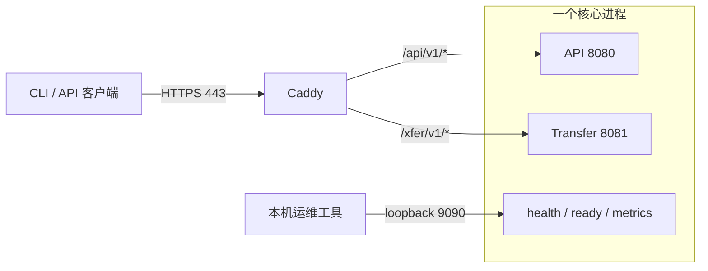

# 单网关部署与本机观测

M1 使用一个 `lantai serve` 核心进程，内部区分 JSON API、文件传输与本机运维监听。对外只有 HTTPS 网关；没有任务执行服务、MCP、网页、长轮询或自动 GC。以下模板供本地和隔离环境审查使用，不包含真实域名、证书、凭据或数据。目标机器的部署与故障恢复仍需单独验收。



## 模板与依赖

| 文件 | 用途 |
|---|---|
| [Caddyfile](../deploy/Caddyfile) | 单 HTTPS 入口、手动证书、API/传输分流、其余路径 404 |
| [config.native.yaml](../deploy/config.native.yaml) | 原生运行，三个监听均绑定数字 loopback |
| [config.container.yaml](../deploy/config.container.yaml) | 容器私网 API/传输监听；运维仍仅容器内 loopback |
| [compose.yaml](../deploy/compose.yaml) | 一个核心容器与一个网关容器，仅网关发布端口 |
| [Dockerfile](../deploy/Dockerfile) | Go 1.26.8 编译、无 shell 的非 root 核心镜像 |
| [lantai.service](../deploy/lantai.service) | Linux systemd 核心服务模板，固定单进程、优雅停止 |

网关固定 **Caddy 2.11.4**，Apache-2.0；[官方发布](https://github.com/caddyserver/caddy/releases/tag/v2.11.4)提供二进制、SHA-512 校验和与签名，[许可证](https://github.com/caddyserver/caddy/blob/v2.11.4/LICENSE)随官方包保留。容器模板使用[官方 Caddy 镜像](https://hub.docker.com/_/caddy)，实际部署应再记录所用平台镜像摘要。Go 版本与仓库 `go.mod` 一致，BSD-3-Clause；核心其余依赖见[依赖说明](dependencies.md)。没有新增 Go 运行依赖，也不自动安装网关。

## 本地原生运行

先在仓库外准备独立的本地磁盘数据根和密钥目录。复制原生配置，修改 `instance.name`、`secrets.dir` 和浏览器 `allowed_origins`；不要在配置里放口令或会话。服务账户需要写数据根和密钥目录，网关账户只需要读 TLS 文件。SQLite 不放在网络挂载文件系统。

```sh
go build -o bin/lantai ./cmd/lantai
# LANTAI_HOME 指向仓库外的数据根；先将审核后的 config.yaml 放入该目录。
bin/lantai init --home "$LANTAI_HOME" --admin ada
bin/lantai serve --home "$LANTAI_HOME"
```

初始化交互输入口令、验证器码；恢复码只展示一次。已有实例不重复初始化。服务先取得数据根锁、检查权威状态并恢复/追平，再开放监听；失败不会接受业务流量。停止时先排空 HTTP，再关闭后台写入和数据库。

到期提醒、定时清除与 GC 调度默认关闭。只有在确认保留策略、备份计划与项目 `trash.auto_purge` 后，才在 `config.yaml` 加入 `lifecycle: {scheduler: true}`（可选 `interval_seconds`、`batch`）；也可在服务停止时用 `bin/lantai lifecycle --home "$LANTAI_HOME"` 手动运行一轮。规则见[生命周期调度](contracts/lifecycle-scheduler.md)。外部扩展包需要管理员导入、台账审定与 HumanGrant 启用，一次性宿主不是沙箱，启用时必须明确受信任部署决定，见[扩展包治理](contracts/extension-governance.md)。

另一个终端设置网关环境。以下域名是示例，TLS 文件由部署者在仓库外提供，证书必须覆盖实际域名且客户端信任其签发链。

```sh
export LANTAI_HTTPS_ADDRESS=https://library.example:443
export LANTAI_TLS_CERT=/path/to/tls/cert.pem
export LANTAI_TLS_KEY=/path/to/tls/key.pem
export LANTAI_API_UPSTREAM=127.0.0.1:8080
export LANTAI_TRANSFER_UPSTREAM=127.0.0.1:8081
caddy validate --config deploy/Caddyfile --adapter caddyfile
caddy run --config deploy/Caddyfile --adapter caddyfile
```

模板只监听 HTTPS，不自动开放 HTTP 80、Caddy 管理端口或 HTTP/3 UDP 端口，也不自动申请或续期证书。`LANTAI_GATEWAY_BIND` 默认 `0.0.0.0`；隔离测试设为 `127.0.0.1`，并选非特权随机端口。更换证书后，在本机复核并重启网关；不能靠关闭客户端证书校验解决信任问题。TLS 的手动证书机制见[官方文档](https://caddyserver.com/docs/caddyfile/directives/tls)。

路由不剥离前缀，授权、幂等键、分片摘要和 `Range` 头原样传递。JSON 大小与超时由核心契约限制；文件流使用核心的 I/O 空闲超时与服务端授权档位。网关不配置完整请求/响应缓冲，不重试业务提交，不设置会阻止断连传播的负 `flush_interval`。依据[官方反向代理规则](https://caddyserver.com/docs/caddyfile/directives/reverse_proxy)，模板已实测上传边传边转发、并发 API 与断连取消。

## 容器与系统服务

Compose 的变量必须来自仓库外的本地环境文件：`LANTAI_IMAGE`、`LANTAI_DATA_DIR`、`LANTAI_SECRETS_DIR`、`LANTAI_CONFIG_FILE`、`LANTAI_TLS_DIR`、`LANTAI_DOMAIN`；可选 `LANTAI_HTTPS_PORT` 默认为 443。所有目录使用绝对路径，`LANTAI_TLS_DIR` 含 `cert.pem` / `key.pem`，配置采用容器模板。数据与密钥目录须预先允许 UID/GID 65532 写入；不要以放开全局写权限解决权限问题。

```sh
docker build -f deploy/Dockerfile -t lantai:local .
# 在私有环境文件中将 LANTAI_IMAGE 设为 lantai:local，并填写其余占位值。
docker compose --env-file /path/to/local.env -f deploy/compose.yaml config --quiet
docker compose --env-file /path/to/local.env -f deploy/compose.yaml run --rm -it core init --home /var/lib/lantai --admin ada
docker compose --env-file /path/to/local.env -f deploy/compose.yaml up -d
docker compose --env-file /path/to/local.env -f deploy/compose.yaml stop
```

[Dockerfile 专用忽略文件](../deploy/Dockerfile.dockerignore)仅允许源码和依赖锁文件进入构建上下文，依据 [Docker 官方规则](https://docs.docker.com/build/concepts/context/#filename-and-location)。镜像本身不包含运行数据、主密钥或 TLS 私钥。容器私网不暴露核心端口；运维采样工具应在核心网络命名空间中访问 loopback，不能把 9090 发布或代理到公网。Scratch 镜像没有 shell/curl，不把宿主 `curl localhost:9090` 误当成容器内检查。

systemd 模板需要先创建 `lantai` 服务账户、准备路径并安装已核验二进制；保持数据根、单实例锁与账户一致。容器和 systemd 模板默认不自动重启，不执行自动迁移/恢复/部署。此处未实测 Docker 引擎、systemd 或目标 NAS；本地网关测试不代表这些环境已通过。

## 本机健康与指标

默认访问 `http://127.0.0.1:9090`，不经网关。运维绑定仅接受数字 loopback，拒绝通配符、网卡地址和可变 DNS 名。没有公共 `/debug/pprof`。

| 路径 | 含义 |
|---|---|
| `GET /healthz` | 进程仍存活返回 200；已关闭返回 503，不代表业务可用 |
| `GET /readyz` | 安全状态与同步均就绪返回 200，否则 503；只返回状态、原因代码，不返回本地路径或原始异常 |
| `GET /metrics` | Prometheus 文本格式；源采样失败仍保留其他源，HTTP 503 且该源 `lantai_collector_available=0`，缺失值不伪报零 |

维护/恢复等实例非 ready 状态拒绝新的 API/传输请求，返回 `MAINTENANCE_MODE`。单纯索引同步滞后使 `/readyz` 为 503，`business_ready` 仍为 true，权威精确读取保持可用。在途命令仍由领域屏障和最终权限复验决定接受。

指标固定低基数，不含主体、项目、操作 ID、对象路径或签名：

| 指标组 | 内容与解释 |
|---|---|
| `live` / `ready` / `business_ready` / `writes_open` | 进程、安全状态、同步与写入屏障 |
| `outbox_pending` / `outbox_oldest_age_seconds` | 按 main / ledger / runtime 的未投递数量及最老事件年龄 |
| `operations_pending` / `operations{stage=...}` | 已知阶段统计；receiving、prepared、installed、blocked、quarantined 属待处置，committed/projected/failed/cancelled 不计 pending |
| `events_*` / `query_*` | 热事件、relay 失败、关键消费者滞后、审计/备份水位、投影代次与重建起点 |
| `transfer_*` / `lock_*` | 当前执行/等待数，累计准入与实际竞争等待次数/时长；累计值随进程重启归零 |
| `uploads_open` / `upload_staging_bytes` / `upload_pins` / `upload_retained_bytes` | storage 权威记录的已接收暂存字节与上传保留事实；不含尚未落记录的在途私有文件或孤儿文件，不是磁盘全盘占用 |
| `gc_supported` | M1 固定 0，未运行 GC；不输出伪造的 GC 已释放字节 |
| `disk_available_bytes` / `disk_min_free_bytes` | data/database 所在文件系统的普通账户可用空间与配置阈值；两者可能同一文件系统，不能相加 |
| `sqlite_wal_bytes` | 五库当前 WAL 文件大小；没有 WAL 时为零，数据库缺失/非普通文件时采样失败；采样不执行 checkpoint |
| `backups_complete` / `backups_incomplete` / `backup_pins` | operations 持久备份记录与 pin 计数 |
| `backup_last_complete_timestamp_seconds` / `backup_last_verified_timestamp_seconds` | 最近完成/校验时间；从未备份为 0，不能解释为刚刚完成 |

以上名称均加 `lantai_` 前缀。每次采样有两秒数据库读取上下文期限；不同源之间没有跨库事务，因此是观测快照，不可拿来替代恢复/备份一致性证明。根据数据规模设定采样频率；累计时长按秒，字节按逻辑字节记录。

建议关注：`ready=0`、采样源不可用、磁盘低于阈值、outbox 最老年龄持续增长、消费者滞后不收敛、blocked/quarantined 操作存在、WAL 持续增长及备份长期未完成。具体告警阈值需在目标负载下验收，不自动触发写入或清理。

## 日志与验证

核心默认向 stderr 输出白名单 JSONL：时间、内部随机 `observation_id`、监听面、标准方法、响应状态、字节数、耗时及取消状态。未知方法归为 `OTHER`；不记录 URL、query、请求/响应头、正文、原始异常、客户端 request ID 或真实对象 ID。日志写入经锁串行化，保持流式传输与 ResponseController 的超时能力。

网关关闭访问日志，运行日志过滤请求、头、URL、原始错误与消息字段，保留级别、时间及结构化定位字段；配置依据[官方日志过滤文档](https://caddyserver.com/docs/caddyfile/directives/log)。本机显式初始化/诊断命令可能显示部署者指定路径或一次性初始化材料，不能把整个终端记录作为公开日志上传。

```sh
go test -race ./internal/application ./internal/commands ./deploy
# 显式指向已核验的官方 2.11.4 二进制；不设置时仅网关执行测试会跳过。
LANTAI_TEST_CADDY=/path/to/caddy go test -race -count=1 -run TestCaddySingleHTTPSGateway -v ./deploy
```

网关测试只绑定随机 loopback 端口，生成临时自签名证书并显式信任，使用合成后端验证实际 Caddyfile：TLS、路由隔离、Range、分片头、上传流、并发 API、断连取消、502 失败日志脱敏。单元测试覆盖未知指标、数据库/WAL 缺失、维护入口拒绝、并发日志与超时透传。真实存取/恢复集成与目标机器性能、容器启动、证书轮换、平台恢复演练应分别记录证据。
