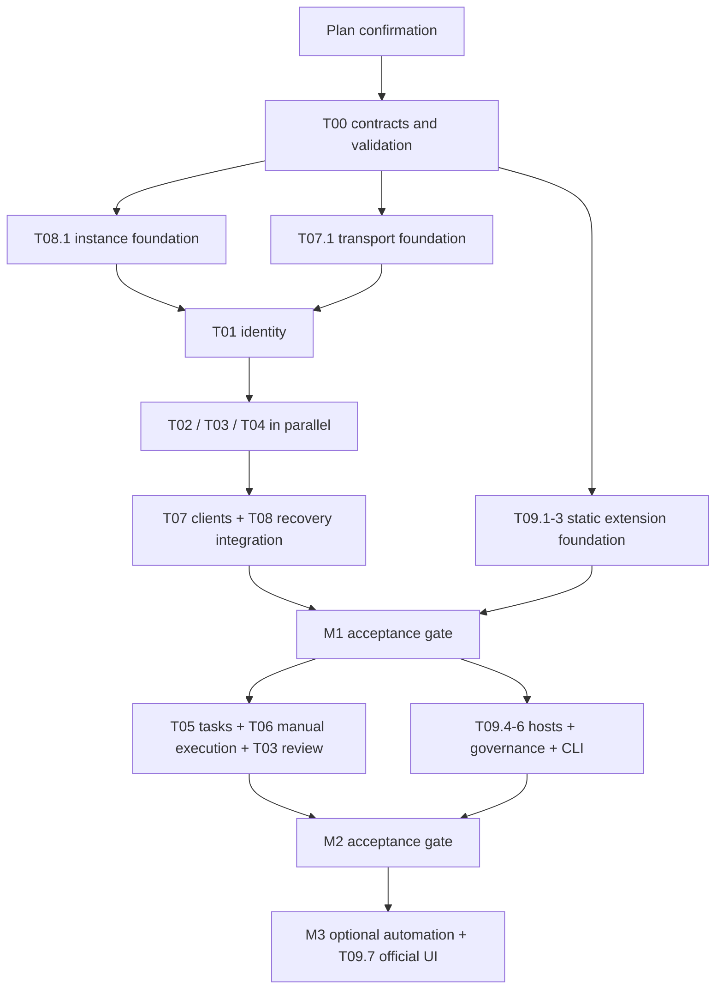

# 开发任务与确认范围

版本：第 1 版。用途：**公开任务基线**，定义范围、职责、阶段、依赖、交付与验收要求；开发范围仍待维护者明确确认。

本目录把服务职责拆为 10 张任务卡。每张卡包含目标、数据归属、阶段、依赖、交付与验收；T06.7 仅保留转交 T09 的历史索引，不计入实现任务。任务进度唯一维护在维护者 Obsidian 的 Lantai「开发与测试」，负责人、阻塞项与执行证据索引也记录于此；本目录不维护逐卡当前状态或完成勾选，也不因存在任务规格而自动创建远端 issue 或执行任务。

## 需要确认的方案

- 一级目录采用 `api/`、`cmd/`、`deploy/`、`docs/`、`internal/`、`plugins/`、`schemas/`、`scripts/`、`sdk/`、`tests/`、`web/`；本轮只建立职责说明。
- `README.md` 使用中文，`README.en.md` 为对应英文版本；服务从 Go 模块化单体起步。
- 按下表的模块所有权协作，首批先做 **T00 与 M1 数据底座**。M2/M3 内容已分解，但依次通过阶段门禁后才推进。
- 任务式 Agent workflow 按 M1 契约、M2 手动执行、M3 自动托管实施。具体外部后端留待验证，不将 DeerFlow 设为核心依赖。
- 插件实现规格以[扩展设计 v2.1](../extensions.md)为唯一权威，[T09](T09-extension-platform.md)按阶段交付；M1 仅统一清单 schema、扩展点 ID、内置静态登记及产物/证据来源字段，CLI/Web 只预留，不建设通用 DI、跨插件依赖图、多层配置或卸载容器。

扩展登记、启用、宿主、熔断及升级统一归 T09；T06 继续拥有 Agent 与 Job 的业务执行。此次补全文档不代表开始开发，开发以维护者明确确认的范围为限，后续阶段通过前置门禁后实施；已授权范围内不逐卡重复确认。

维护者确认本版目录与任务后，再建立工程、锁定依赖、编写源码与测试。此确认范围不包含生产部署、真实数据迁移或启用自动化触发；这些动作在形成具体执行方案后分别处理。

## 模块总表

| 编号 | 任务卡 | 首次交付与后续范围 |
|---|---|---|
| T00 | [工程与共享契约](T00-foundation.md) | M1 工程、协议、依赖与技术验证；执行协议预留 |
| T01 | [身份与安全](T01-identity-security.md) | M1 初始化、会话、授权；M2 人审接入与最小项目管理 |
| T02 | [资源与存储](T02-assets-storage.md) | M1 可靠入藏与传输；M2 回收站文件动作、上下文与决议 |
| T03 | [台账与溯源](T03-ledger-provenance.md) | M1 版本登记/来源；M2 审定、发布、生命周期及讨论 |
| T04 | [事件与查询](T04-events-query.md) | M1 outbox/审计/查询重建；M2 外部事件消费与收件箱 |
| T05 | [任务与业务流程](T05-tasks-workflow.md) | M1 schema；M2 任务/租约/固定 Flow；M3 分支并行 |
| T06 | [Agent 执行与节点](T06-execution-nodes.md) | M1 schema；M2 manual-cli/worker/检查闭环；M3 Runner |
| T07 | [REST、CLI、MCP 与 SDK](T07-api-clients.md) | M1 REST/CLI；M2 协作入口、MCP、最小 Python SDK |
| T08 | [运维、恢复与部署](T08-operations-deploy.md) | M1 起贯穿：启动、迁移、备份恢复、流量隔离与平台门禁 |
| T09 | [扩展平台](T09-extension-platform.md) | M1 清单/扩展点/内置静态登记/来源字段；M2 一次性宿主/包治理/CLI；M3 官方/声明式 UI；依赖容器、常驻服务和第三方网页按需 |

任务编号表示职责，**不表示 T00 → T09 逐项串行开发**。T02/T03、T05/T06、T06/T09 都需要共享契约、桩与联合验收，不能互相要求整卡先完成。T09.10 的契约与故障套件贯穿各阶段，不留到最后补做。

## 开发批次与依赖

| 批次 | 执行内容 | 开始条件 | 出口 |
|---|---|---|---|
| B0 工程与协议 | T00.1–T00.6；T05.1/T06.1/T09.1 联合提交协议；T09.10 建立契约反例 | 本版开发范围获明确确认 | 核心契约、统一 extension.yaml schema 与来源字段、工程验证记录；不要求扩展常驻/网页隔离小样 |
| B1 可启动实例 | T08.1 与 T07.1 并行；接入 T01 的 M1 部分 | 最小 T00 接口稳定；其余 spike 可并行 | 单实例、五库迁移、认证会话、最小 API/CLI 骨架 |
| B2 可靠存取 | T02.1–T02.5、T03.1–T03.3、T04 的 M1 部分并行；T09.2/T09.3 接入内置 processor/validator 静态登记；T07.2–T07.4 与 T08.2–T08.4 持续接线 | B1；各模块可先使用契约桩 | CLI 认证→上传→提交→精确拉取→事件与查询→备份恢复；内置登记和产物/证据来源可验证，不支持能力明确拒绝 |
| B3 M1 门禁 | T00 技术结果落地，T08.5 汇总各模块故障/平台/传输验收；T09.10 核验 M1 扩展契约 | B2 真模块集成 | M1 验收通过；失败项有明确责任任务 |
| B4 M2 固定闭环 | T05.2–T05.5、T06.2–T06.5、T03.4–T03.7；T09.4–T09.6 与 T06/T07 联合接线；补其他模块 M2 子项，持续执行 T09.10 | M1 门禁；M2 属于已确认开发范围 | 至少一次退回的制作→检查→质检→人审→发布；回收站恢复；文件协议一次性检查、包治理/撤权/排空/熔断与显式 CLI 通过验收 |
| B5 M3 自动化与网页 | T05.6、T06.6；T09.7 官方/声明式 UI；T09.10 验证已选能力，具体页面/处理器另拆执行卡 | M2 门禁；对应阶段属于已确认范围且选定后端协议实测通过 | 明确后端与能力边界，再启用选定触发；第三方网页、常驻服务及跨插件依赖另按真实需求立项 |

图表示集成门禁，不禁止领域模块提前用桩开发。不同任务共用的契约变更需明确影响方，不能靠复制类型消除编译冲突。

## 阶段验收与责任

| 门禁 | 必须出现的证据 | 牵头与参与 |
|---|---|---|
| M1 身份与内容 | 初始化只一次；撤权生效；同 operation 不重复版本；无 Blob 越权；1 GB 续传哈希一致 | T01/T02/T03，T07 调用 |
| M1 一致性 | 每个提交持久化边界故障后完整恢复或隔离；outbox 重放无重复业务；索引可重建 | T02/T03/T04，T08 注入与恢复 |
| M1 实例与传输 | 空目录恢复、旧授权失效；三平台运行证据；批量传输下 API/交互容量保留；运维端点不外露 | T08 牵头，T00/T02/T07 |
| M1 扩展底座 | 单一 extension.yaml / lantai.extension/v1；扩展点 ID 与内置静态登记；产物/证据绑定插件 ID、版本、包摘要；CLI/Web 不激活，重复 ID 与不支持能力拒绝 | T09.1–T09.3/T09.10，T00/T02/T03 |
| M2 协作 | 同席位唯一有效 Attempt；旧 fence 拒绝；人工答复不复活租约；取消不伪报已停止 | T05/T06 |
| M2 审定发布 | 制作与独立质检、一次退回、动作绑定人审、新旧发布指针、误审撤销与回收站恢复 | T03 牵头，T01/T02/T05/T06/T07 |
| M2 上下文与入口 | 生效上下文版本固定；讨论不越权；CLI/MCP/SDK 返回一致结果；手动执行/假后端通过协议测试 | T01/T02/T03/T04/T05/T06/T07 |
| M2 扩展执行与治理 | 文件协议 spawn/run/exit、获授权受限 probe 与进程清理；包审定/启用分离，撤权/排空正确；旧 activation 与任务 fence 均拒绝；按规格验证熔断时间窗与单探针，合法检查 fail 不计故障；CLI 不执行未登记入口 | T09.4–T09.6/T09.10，T01/T03/T06/T07/T08 |
| M3 自动后端 | 启动响应丢失、失联对账、checkpoint 兼容性、预算与取消、事件/定时触发去重 | T05/T06，T08 恢复验证 |
| M3 官方/声明式网页 | 官方插槽、设置和后备展示按契约工作；视图订阅可回收；登录、权限和人审归宿主 | T09.7/T09.10，T01/T07 |
| 按需扩展门禁 | 第三方网页先验证独立 origin、与主站不同的可注册域及目标浏览器 site 隔离、无会话凭据及 Origin/CSRF/broker；内网特殊后缀须实测；常驻服务与跨插件依赖按实际需求验收 | T09.3 后续部分/T09.8–T09.10，T01/T04/T07/T08 |

## 每个任务如何交付

1. 启动时在知识库「开发与测试」对应任务卡记录负责人、子任务 ID、阶段、依赖版本与本仓库任务基线版本，并更新执行状态；阻塞原因和后续行动也记录于该卡。同一模块可分多个实现变更；不要一张卡一次提交全部 M1–M3。
2. 提交所属代码、迁移与契约变更；附覆盖真实不变量的测试及可重复验收命令。数据结构/行为变更同步相关公开文档。
3. 在知识库执行记录中写明代码版本、平台、输入摘要、命令、结果与不支持项，由任务卡链接证据；区分“schema 已定”“模块测试通过”和“端到端已通过”。公开的合成测试、可重复命令及脱敏证据随仓库维护，私有运行材料不入库。
4. 故障/安全/恢复用例通过后，才在知识库更新相应子任务的完成状态，仓库任务卡不重复勾选。桩不能替代阶段集成，生成代码通过不能替代授权和业务检查。
5. 公共仓库保持脱敏；业务模块不直接操作其他模块表。并行开发先共享协议，再共享已验证实现。

文档检查只证明本次交接材料一致，不代表上述实现或测试已完成。

## 后续工作

| 阶段 | 预留工作 | 进入前再拆的执行卡 |
|---|---|---|
| M3 | 网页登录/待审/任务/回收站、更多媒体/3D 插件、触发与运行器 | 网页扩展仅 T09.7 官方/声明式 UI；页面流程、各处理器及选定后端分别写契约与验收 |
| 按需 | 跨插件依赖/服务容器、常驻服务、第三方网页 | T09.3 后续部分、T09.8/T09.9 分别立项，不计入 M3 完成条件 |
| M4 | 独立迁移工具、映射与未知状态隔离、受控导入和观察期 | M2 后制定；真实扫描和批量迁移须另行明确授权 |
| M5 | 缩略图、代理、波形、转台、标注、版本对比 | 按资产类型与观看需求拆分 |
| M6 | 语义检索、Blender/OpenAssetIO 等出口 | 基于已验证引用、用途和权限约束 |
| M7 | SSE/节点长连接、Webhook、IM 桥 | 独立长连接面、投递去重与授权 |
| M8 | 多卷、存储节点、馆际协作 | 拓扑、身份、恢复与一致性先另行设计 |

这些是后续路线，不作为 M1/M2 完成条件，也不因确认本版目录而自动部署或运行。
